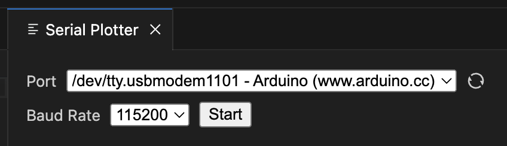
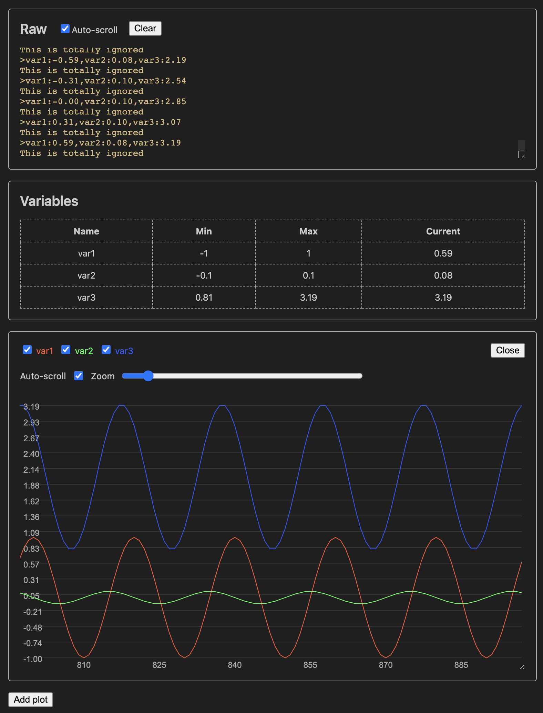

# Serial Plotter
VS Code extension for plotting data received via a serial port, such as from an Arduino connected via USB. It pairs well with the VS Code PlatformIO extension.

## Data & Formatting
The serial plotter displays numerical data received via the serial port. It expects the device to send data in a line-based format, with each line ending in `\r\n`. Lines meant for the plotter must start with `>`, followed by one or more `variable_name:value` pairs separated by commas, and ending with `\r\n`. Variable names can be any UTF-8 sequence except `:`. Values should be integers or decimal numbers using `.` as the decimal point. For example:

```
>pin0:0.0342,brightness:234,temp:25.7\r\n
>pin0:2.34,brightness:200\r\n
>pin0:10,brightness:12\r\n
```

The plotter ignores lines that don't start with `>`.

Upon receiving a valid line:
1. It parses all `variable_name:value` pairs.
2. The values are added to their corresponding variable's list.
3. If a variable from a previous line isn't in the new one, its last value is appended to keep all variable lists synchronized.

This method maintains equal data lengths for each variable without needing timestamps.

Example of device-side communication:

```cpp
void setup() {
  Serial.begin(112500);
}

float angle = 0;
void loop() {
  Serial.print(">");

  Serial.print("var1:");
  Serial.print(cos(angle));
  Serial.print(",");

  Serial.print("var2:");
  Serial.print(cos(angle + PI / 2) * 0.1);
  Serial.print(",");

  Serial.print("var3:");
  Serial.print(cos(angle + PI / 4) * 1.2 + 2);
  Serial.println(); // Writes \r\n

  Serial.println("This is totally ignored");
  delay(100);

  angle += PI / 10;
}
```

The baud rate is set to `112500`. In `loop()`, a new line with `var1`, `var2`, and `var3` is emitted, using scaled sine waves as values. Another line, ignored by the plotter, is emitted afterward.

## Opening the Plotter
In VS Code, press `CTRL + SHIFT + P` (`CMD + SHIFT + P` on macOS) to open the command palette. Type `Serial Plotter: Open pane` and select the command. The pane will open.

## Selecting Port & Baud Rate



Choose your port from the dropdown list. If you connected your device after opening the pane, click the refresh button. Select the correct baud rate to match your device configuration.

## Monitoring
After selecting the port and baud rate, click `Start`. You may see output like this:



The serial plotter connects to the port and waits for incoming data. The `Raw` panel shows the last 1000 lines of raw serial data. Use the `Hide data lines` checkbox to toggle showing lines starting with `>`. The `Variables` pane displays all variables encountered, including their min, max, and current values.

A plot pane shows all variables from the first data line by default. Use checkboxes to show or hide variables. Uncheck `auto-scroll` to manually inspect the data. You can drag the plot left or right to explore the data further. Adjust the `zoom` slider to change the sample range (from 10 to 1000), that is, the number of samples visible in the plot. Use `Close` to close the plot.

You can add more plots with the `Add plot` button.

Click `Stop` to stop monitoring. You can still review the data from the stopped session.

## Known Issues
- A serial port can only be accessed by one process at a time. You cannot monitor a port and upload a program to the Arduino simultaneously. Ensure no other process is using the port if the plotter can't connect. Similarly, if you're having trouble uploading to the Arduino, make sure the serial plotter isn't monitoring the port.
- If you create multiple plots with specific variable selections, they need to be recreated when starting a new session.